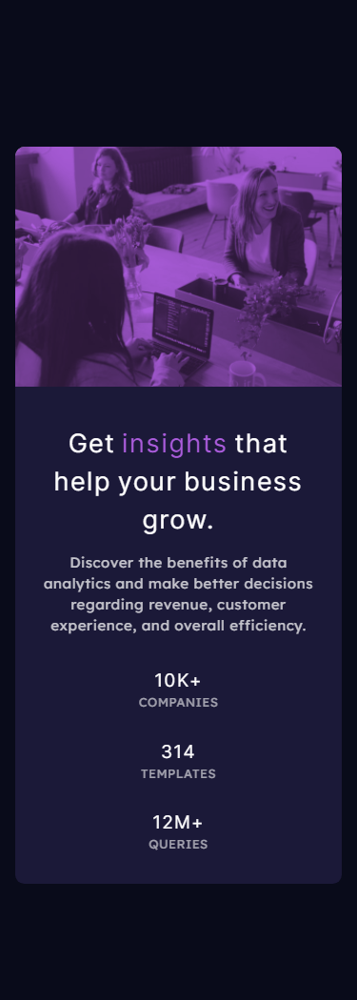

# Frontend Mentor - Stats preview card component solution

This is a solution to the [Stats preview card component challenge on Frontend Mentor](https://www.frontendmentor.io/challenges/stats-preview-card-component-8JqbgoU62). Frontend Mentor challenges help you improve your coding skills by building realistic projects. 

## Table of contents

- [Overview](#overview)
  - [The challenge](#the-challenge)
  - [Screenshot](#screenshot)
  - [Links](#links)
- [My process](#my-process)
  - [Built with](#built-with)
  - [What I learned](#what-i-learned)
  - [Continued development](#continued-development)
  - [Useful resources](#useful-resources)
- [Author](#author)
- [Acknowledgments](#acknowledgments)

## Overview

### The challenge

Users should be able to:

- View the optimal layout depending on their device's screen size

### Screenshot




### Links

- Solution URL: [Add solution URL here](https://jullierme-r.github.io/stats-preview-card/)


### Built with

- Semantic HTML5 markup
- CSS custom properties
- Flexbox
- Media Queries
- Mobile-first workflow

## Author

- GitHub - [jullierme-r](https://github.com/jullierme-r)
- Frontend Mentor - [@jullierme-r](https://www.frontendmentor.io/profile/jullierme-r)

### What I learned

With this project I learned about Blend Modes and how it allows to specify blending between background layers of an element.

```css
.image {
    background-color: var(--accent);
}

.image img {
    mix-blend-mode: multiply;
    opacity: 0.75;
}
```

### Useful resources

- [Basics of CSS Blend Modes](https://css-tricks.com/basics-css-blend-modes/) 
- [CSS Blend Modes](https://highrise.digital/blog/css-blend-modes/) 